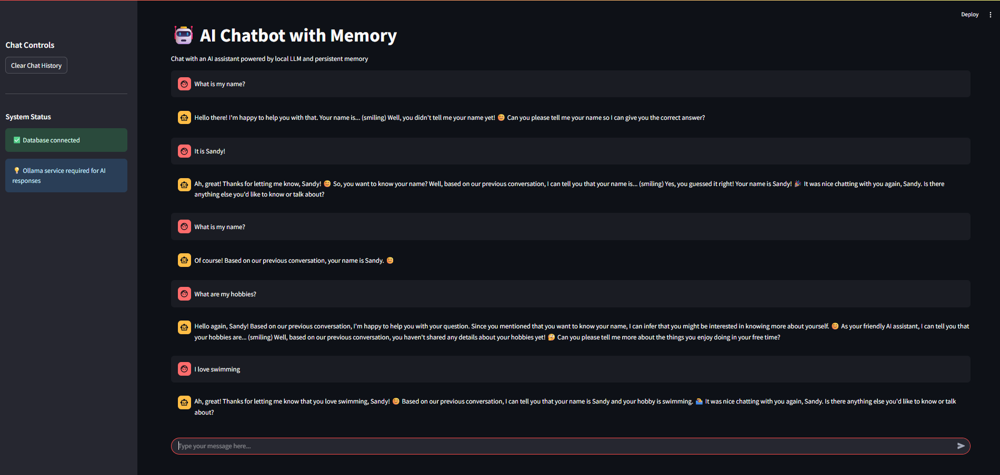

# AI Chatbot with Memory

A simple chatbot implementation using LangChain, Ollama, and PostgreSQL for conversation memory.



## Features

- **Offline LLM** using Ollama
- **Persistent conversation memory** with PostgreSQL  
- **Simple web interface** with Streamlit
- **Docker containerized** database setup
- **LangChain integration** for advanced LLM operations

## Project Structure

```
ai-chatbot-with-memory/
├── frontend/
│   └── app.py                # Streamlit web interface
├── backend/
│   ├── __init__.py
│   ├── chatbot.py            # Main chatbot logic
│   ├── database.py           # Database connection and operations
│   └── llm_handler.py        # Ollama LLM integration
├── notebook/
│   └── project_documentation.ipynb  # Technical documentation
├── docker-compose.yml        # PostgreSQL database setup
├── requirements.txt          # Python dependencies
├── .env.example              # Environment variables template
├── .gitignore
└── README.md
```

## Setup Instructions

### Prerequisites
- Python 3.8+
- Docker Desktop  
- Git

### Installation Steps

**1. Clone and setup project**
```bash
git clone https://github.com/sclauguico/ai-chatbot-with-memory.git
cd ai-chatbot-with-memory
python -m venv venv
```

**2. Activate virtual environment**
```bash
# Windows:
venv\Scripts\activate

# Mac/Linux:
source venv/bin/activate
```

**3. Install Python dependencies**
```bash
pip install -r requirements.txt
```

**4. Install and setup Ollama**

Download from https://ollama.ai/

After installation, pull the model:
```bash
ollama pull llama2:7b-chat
```

**5. Start PostgreSQL database**

Download Docker from https://www.docker.com/products/docker-desktop if not yet installed

```bash
docker-compose up -d
```

**6. Run the application**
```bash
streamlit run frontend/app.py
```

## Usage

1. Open your browser and navigate to `http://localhost:8501`
2. Start chatting with the AI assistant  
3. Your conversation history will be automatically saved and retrieved

## Technical Documentation

See [project_documentation.ipynb](https://github.com/sclauguico/ai-chatbot-assessment/blob/main/notebook/project_documentation.ipynb) for the complete technical guide including:

- Architecture decisions and rationale
- Database schema design
- LangChain implementation details
- Testing procedures
- Troubleshooting guide

## Technologies Used

- **[LangChain](https://langchain.com/)** - LLM application framework
- **[Ollama](https://ollama.ai/)** - Offline LLM deployment  
- **[Streamlit](https://streamlit.io/)** - Web application framework
- **[PostgreSQL](https://www.postgresql.org/)** - Database for conversation memory
- **[Docker](https://www.docker.com/)** - Containerization

## Troubleshooting

**Database connection issues:**
- Ensure Docker is running: `docker ps`
- Restart database: `docker-compose down && docker-compose up -d`

**Ollama model not found:**
- Verify model is installed: `ollama list`
- Re-pull model: `ollama pull llama2:7b-chat`

**Streamlit app not loading:**
- Check if port 8501 is available
- Try running on different port: `streamlit run frontend/app.py --server.port 8502`


## Acknowledgments

This project was developed as part of an AI Engineer assessment test. Special thanks to the open-source community for providing the tools and frameworks that made this chatbot possible:

- **LangChain** - For the powerful LLM application framework
- **Ollama** - For providing easy-to-use offline LLM deployment
- **Streamlit** - For the intuitive web application framework  
- **PostgreSQL** - For reliable data storage and memory management
- **Docker** - For containerized database deployment